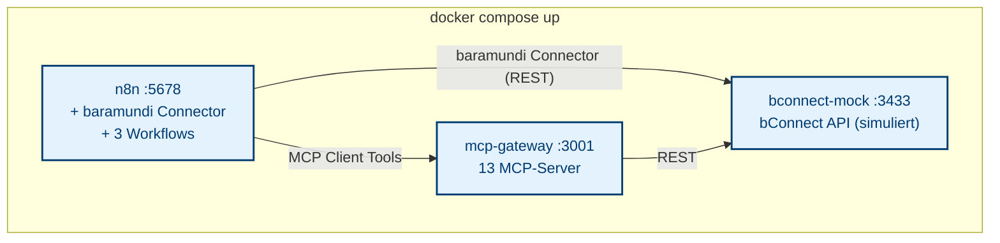

# baramundi come2gether 2026 Challenge

**Automatisiere eine wiederkehrende IT-Admin-Aufgabe mit n8n und/oder MCP mit der bConnect API.**

Dieses Repo liefert eine schlüsselfertige Docker-Umgebung mit allem was du brauchst:

- **n8n** mit vorinstalliertem baramundi Connector (6 Nodes, 229 Operationen)
- **bConnect Mock** (simulierte bMS REST API mit realistischen Testdaten)
- **MCP Gateway** (13 KI-fähige MCP-Server für Claude und andere AI Agents)
- **3 Beispiel-Workflows** als Inspiration und Startpunkt

## Quick Start

```bash
git clone https://github.com/baramundisoftware/come2gether-2026-challenge.git
cd come2gether-2026-challenge
```

> **Git nötig.** Der `git clone`-Befehl braucht Git — Windows bringt es **nicht**
> von Haus aus mit. Wird `git` **nicht erkannt** (`'git' is not recognized as an
> internal or external command`), installiere [Git für Windows](https://git-scm.com/download/win)
> und öffne danach ein **neues** Terminal (PowerShell/CMD), damit `git` im PATH ist.
> Ohne Git: das Repo auf GitHub über **Code → Download ZIP** laden und entpacken.

### An der GitHub Container Registry anmelden (einmalig)

Die Container-Images liegen **privat** in der GitHub Container Registry (GHCR).
Melde dich einmal an, sonst bricht `docker compose up` mit `denied` ab:

```bash
gh auth refresh -s read:packages      # Scope einmalig ergaenzen — braucht gh >= 2.17
gh auth token | docker login ghcr.io -u "$(gh api user --jq .login)" --password-stdin
```

Ohne die `gh` CLI **oder mit gh < 2.17** (`gh --version` prüfen — das Ubuntu-Paket
liefert z. B. 2.4.0, dort fehlt `gh auth token`): Erstelle ein Personal Access Token
(classic) mit Scope `read:packages` unter https://github.com/settings/tokens
und nutze es als Passwort:

```bash
echo DEIN_TOKEN | docker login ghcr.io -u DEIN-GITHUB-USER --password-stdin
```

> **Bei `denied` zuerst `gh --version` prüfen.** Altes `gh` kennt `gh auth token`
> nicht und schiebt stattdessen seine Fehlermeldung als Passwort in die Pipe —
> das sieht wie ein Rechteproblem aus, ist aber keins.
> Erst danach: Mitgliedschaft in der `baramundisoftware`-Organisation mit
> **Read**-Zugriff auf die Pakete — dafür den Challenge-Owner ansprechen.

Konfiguration anlegen:

| Plattform | Befehl |
|-----------|--------|
| **Linux / Mac** | `cp .env.example .env` |
| **Windows (PowerShell)** | `Copy-Item .env.example .env` |
| **Windows (CMD)** | `copy .env.example .env` |

Dann starten:

```bash
docker compose up -d
```

Öffne http://localhost:5678 — Login: `demo@c2g.local` / `Baramundi2026`

> **Voraussetzung:** [Docker Desktop](https://www.docker.com/products/docker-desktop/)
> (Windows / Mac) oder Docker Engine + Docker Compose (Linux).
> Falls dein Linux-System nur `docker-compose` (V1) hat, ersetze
> `docker compose` durch `docker-compose` in allen Befehlen.
>
> 🐳 **Neu bei Docker?** Das [Docker-Tutorial für Einsteiger](docs/docker-tutorial.md)
> erklärt in 10 Minuten alles, was du für diese Challenge brauchst.

## Architektur



> Umschaltung Mock / Real bConnect: nur `.env` anpassen.

### Datenfluss

1. **n8n** führt Workflows aus und nutzt den **baramundi Connector** oder **MCP Client Tools**
2. Der Connector spricht direkt mit der **bConnect REST API** (Mock oder Real)
3. Die MCP Client Tools sprechen mit dem **MCP Gateway**, der die Anfragen an bConnect weiterleitet
4. Der **bConnect Mock** simuliert eine vollständige baramundi Management Suite mit realistischen Daten

## Images: ziehen oder selbst bauen

`docker compose up -d` zieht alle drei Images (Mock, Gateway, n8n) als fertige
**Multi-Arch-Images (amd64 + arm64)** aus der GHCR — auch auf Apple Silicon läuft
alles nativ. Der baramundi Connector ist im n8n-Image bereits installiert; du
musst nichts bauen.

**Für die Challenge brauchst du diesen Abschnitt nicht.** Wer das n8n-Image
anpassen will (z. B. anderer Connector), kann es selbst bauen — dieses Repo ist
dafür eigenständig: der Connector liegt als Tarball unter [`vendor/`](vendor/),
das Dockerfile unter [`docker/`](docker/).

```bash
make build      # baut das n8n-Image lokal und überschreibt das gezogene
make pull       # holt die GHCR-Images (wieder) zurück
```

Mock und MCP-Gateway kommen **immer** aus der GHCR (sie werden aus ihren eigenen
Repos veröffentlicht). Maintainer publizieren ein neues Multi-Arch-n8n-Image mit
[`scripts/publish-image.sh`](scripts/publish-image.sh) (Version aus `VERSION`).

## Die 3 Beispiel-Workflows

### Workflow 1: Endpoint-Übersicht (Einfach)

**Trigger:** Manuell | **Nodes:** 7 (+ 1 Sticky Note)

Holt alle Endpoints (Windows, Linux, Mac) über den baramundi Connector,
führt sie zusammen und erzeugt eine HTML-Seite mit:
- Farbige Kacheln pro Endpoint-Typ (Zusammenfassung)
- Tabelle mit Hostname, Typ, OS, IP, Benutzer, letzter Kontakt
- baramundi Branding (Primärblau #00a3e0, Dunkelblau #003c71)

**Lerneffekt:** n8n Grundlagen, Connector-Nutzung, Merge-Node, HTML-Templating

### Workflow 2: Software-Compliance (Mittel)

**Trigger:** Schedule (täglich) + Manuell | **Nodes:** 9 (+ 1 Sticky Note)

Prüft installierte Software gegen konfigurierbare Regeln:
- **Allowlist:** Erlaubte Standard-Software (Office, Chrome, Teams, ...)
- **Blocklist:** Verbotene Software (Torrent, Spiele, Remote-Tools)
- **Pflicht-Software:** Muss installiert sein (Office, Chrome)
- **Versionscheck:** Veraltete Versionen erkennen (Java, Acrobat)

Erzeugt einen HTML-Report mit Ampel-System (Konform / Warnung / Kritisch)
oder eine kurze "Alles OK" Meldung.

**Lerneffekt:** Scheduled Workflows, Daten-Enrichment (Endpoints + Software),
bedingte Logik (IF-Node), praxisnahe IT-Compliance

### Workflow 3: KI-Infrastruktur-Berater (Fortgeschritten)

**Trigger:** Manuell | **Nodes:** 8 (+ 2 Sticky Notes) | **Braucht:** Anthropic API Key

Claude AI Agent mit drei MCP-Server-Anbindungen:
- **MCP: Endpoints** — 47 Tools für Endpoint-Verwaltung
- **MCP: Jobs** — 24 Tools für Job-Management
- **MCP: Compliance** — 8 Tools für Compliance und Schwachstellen

Der Agent entscheidet autonom, welche Tools er aufruft, und erzeugt
einen strukturierten Infrastruktur-Gesundheitsbericht.

**Lerneffekt:** KI-Agenten, MCP-Protokoll, Tool-Use, autonome Entscheidungsfindung

## Mock oder echtes bConnect?

Die `.env`-Datei steuert das Ziel. Default ist der Mock — kein echtes bMS nötig.

```env
# Mock (Default)
BCONNECT_BASE_URL=http://bconnect-mock:3433/bconnect

# Echtes bMS (anpassen):
# BCONNECT_BASE_URL=https://bms.example.com:444/bconnect
# BCONNECT_API_KEY=dein-api-key
```

Nach Änderung: `docker compose down -v && docker compose up -d`

### Mock-Daten

Der bConnect Mock liefert realistische Testdaten:

| Datentyp | Anzahl | Details |
|----------|--------|---------|
| Windows Endpoints | 10 | NYC, London, Berlin, Singapore, ... |
| Linux Endpoints | 3 | verschiedene Distributionen |
| Mac Endpoints | 2 | macOS |
| Software-Titel | 10 | Office, Chrome, Teams, 7-Zip, ... |
| Job-Definitionen | 5 | verschiedene Job-Typen |
| Compliance Rules | mehrere | 26R1-spezifisch |
| Vulnerabilities | mehrere | CVSS-Scores, CVE-IDs |

## KI-Workflow (Workflow 3)

Für den KI-Workflow brauchst du einen Anthropic API Key:

1. Key erstellen: https://console.anthropic.com/
2. In `.env` eintragen: `ANTHROPIC_API_KEY=dein-key-hier`
3. Container neu starten: `docker compose down -v && docker compose up -d`
4. In n8n: Credential "Anthropic API" mit dem Key konfigurieren

Workflows 1 und 2 funktionieren auch ohne API Key.

## Deine Challenge

| Dokument | Inhalt |
|----------|--------|
| [challenge/AUFGABE.md](challenge/AUFGABE.md) | Aufgabenstellung und Regeln |
| [challenge/BEWERTUNG.md](challenge/BEWERTUNG.md) | Bewertungskriterien (100 Punkte) |
| [challenge/TIPPS.md](challenge/TIPPS.md) | Hilfreiche Tipps, Node-Referenz, Fehlerbehebung |
| [docs/docker-tutorial.md](docs/docker-tutorial.md) | Docker-Grundlagen für Einsteiger (10 Min.) |

## Projektstruktur

```
come2gether-2026-challenge/
├── README.md                          # Diese Datei
├── docker-compose.yml                 # 3 Services: Mock + Gateway + n8n
├── .env.example                       # Konfigurations-Vorlage
├── Makefile                           # build (n8n lokal), pull, test, clean
├── VERSION                            # Version des n8n-Images
│
├── workflows/
│   ├── 01-endpoint-overview.json      # Einfach: Endpoint-HTML-Übersicht
│   ├── 02-software-compliance.json    # Mittel: Compliance mit Ampel-Report
│   └── 03-ai-infra-advisor.json       # KI: Claude + 3 MCP Server
│
├── docker/                            # Self-contained n8n-Image-Build
│   ├── Dockerfile                     # n8n + baramundi Connector (ohne Mock)
│   └── *.sh                           # Entrypoint + Seed-Skripte
│
├── vendor/                            # Eingebundener Connector-Tarball (0.9.1)
│
├── challenge/
│   ├── AUFGABE.md                     # Aufgabenstellung
│   ├── BEWERTUNG.md                   # Bewertungskriterien
│   └── TIPPS.md                       # Hilfreiche Links und Tipps
│
├── docs/
│   └── docker-tutorial.md            # Docker-Grundlagen für Einsteiger
│
├── scripts/
│   ├── setup-owner.sh                 # Automatisches n8n Owner-Setup
│   └── publish-image.sh              # n8n-Image multi-arch nach GHCR publizieren
│
├── branding/
│   ├── baramundi-logo.svg             # Logo für HTML-Reports
│   └── styles.css                     # baramundi CSS-Farbschema
│
└── tests/                             # BATS-Testsuite (45 Tests)
    ├── lint.sh                        # Statische Analyse + Security
    ├── smoke.bats                     # Container-Startup (11 Tests)
    ├── workflow-01.bats               # Workflow 1 Struktur (8 Tests)
    ├── workflow-02.bats               # Workflow 2 Struktur (9 Tests)
    ├── workflow-03.bats               # Workflow 3 Struktur (9 Tests)
    ├── mcp-gateway.bats               # MCP Gateway (3 Tests)
    ├── switch-target.bats             # Mock/Real Umschaltung (5 Tests)
    └── helpers/
        └── setup.bash                 # BATS-Hilfsfunktionen
```

## Fehlerbehebung

**`docker login` sagt `denied`?**
- Meist keine fehlenden Rechte, sondern zu altes `gh`: `gh --version` prüfen
  (nötig: >= 2.17), sonst den PAT-Weg im [GHCR-Abschnitt](#an-der-github-container-registry-anmelden-einmalig) nutzen.
- Richtiger Account? `gh api user --jq .login`

**Container starten nicht?**
```bash
docker compose logs -f        # Logs prüfen
docker compose down -v         # Neustart mit frischen Volumes
docker compose up -d
```

**n8n zeigt keine Workflows?**
- Die Workflows werden beim ersten Start automatisch importiert (Seed-Mechanismus)
- Bei Problemen: `docker compose down -v && docker compose up -d` (Volumes zurücksetzen)

**MCP-Tools nicht verfügbar?**
- Gateway-Health prüfen: http://localhost:3001/health im Browser öffnen
- MCP-URLs in n8n müssen `http://mcp-gateway:3001/...` sein (Docker-Netzwerk)

**Windows: Ports blockiert?**
- Stelle sicher, dass die Ports 3433, 3001 und 5678 frei sind
- Windows Firewall oder VPN können Docker-Ports blockieren
- In Docker Desktop: Settings → Resources → prüfe ob genug RAM zugewiesen ist (mind. 4 GB)

## Lizenz

MIT
